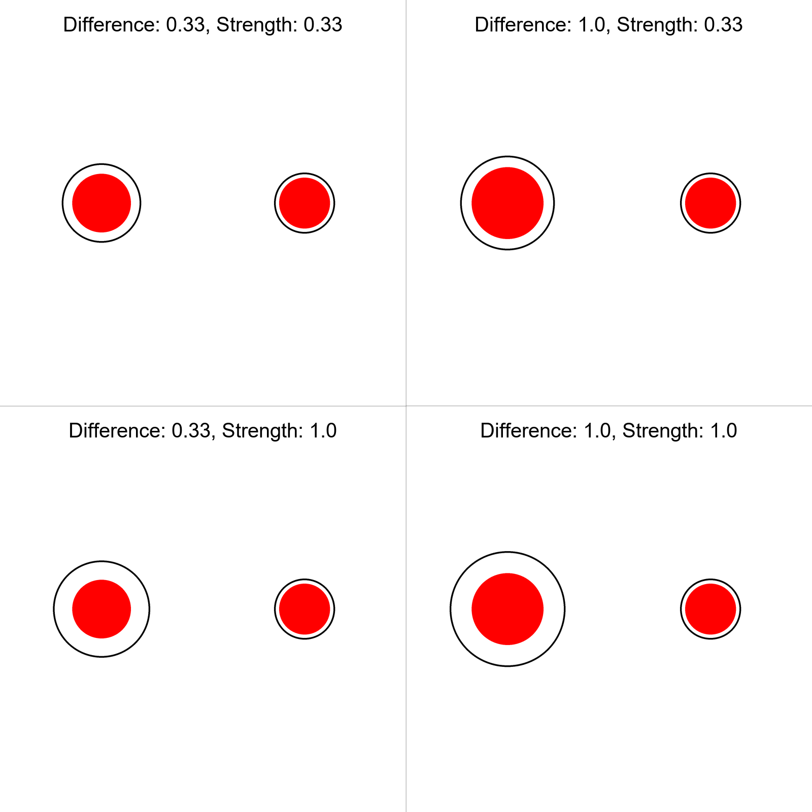
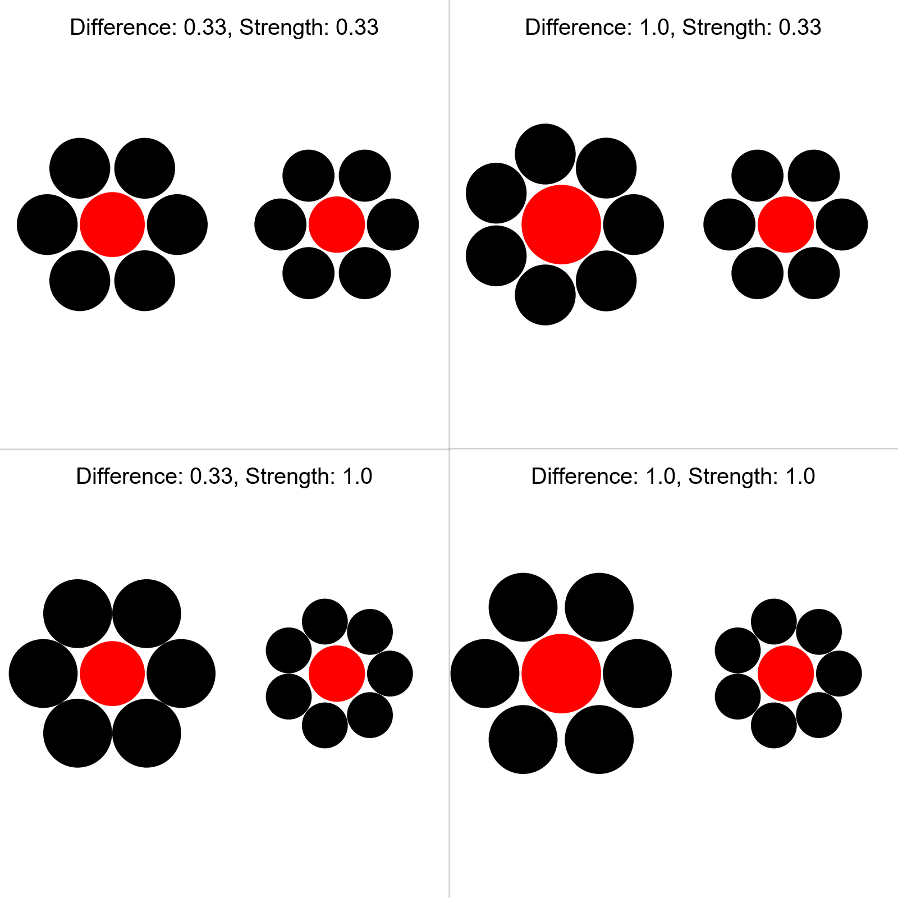

# IllusionGame
A game based on visual illusions.

## To Do
- [x] Basic skeleton of `experiment.js`
- [ ] Decide on size of illusions
  - <s>width: 1024, height: 576</s>
  - images to be squares
- [ ] Include all illusions
- [ ] Set up organization oauth
- [ ] Have data saved after each block and committed to GH even after experiment is quitted halfway
- [ ] Pop up to go full screen
- [ ] Finalize instructions to clarify on key / screen press
- [ ] Would be more efficient to preload the stimuli before each block (rather than everything at the start)
- [x] Compute score and RT for each block of illusions
- [x] Show feedback after each block of illusions
  - Feedback to consist of **inverse efficiency score** to show participants that they performed better than x% of the players
- [x] Final feedback to show overall score
- [x] Preprocessing script

## Stimuli

