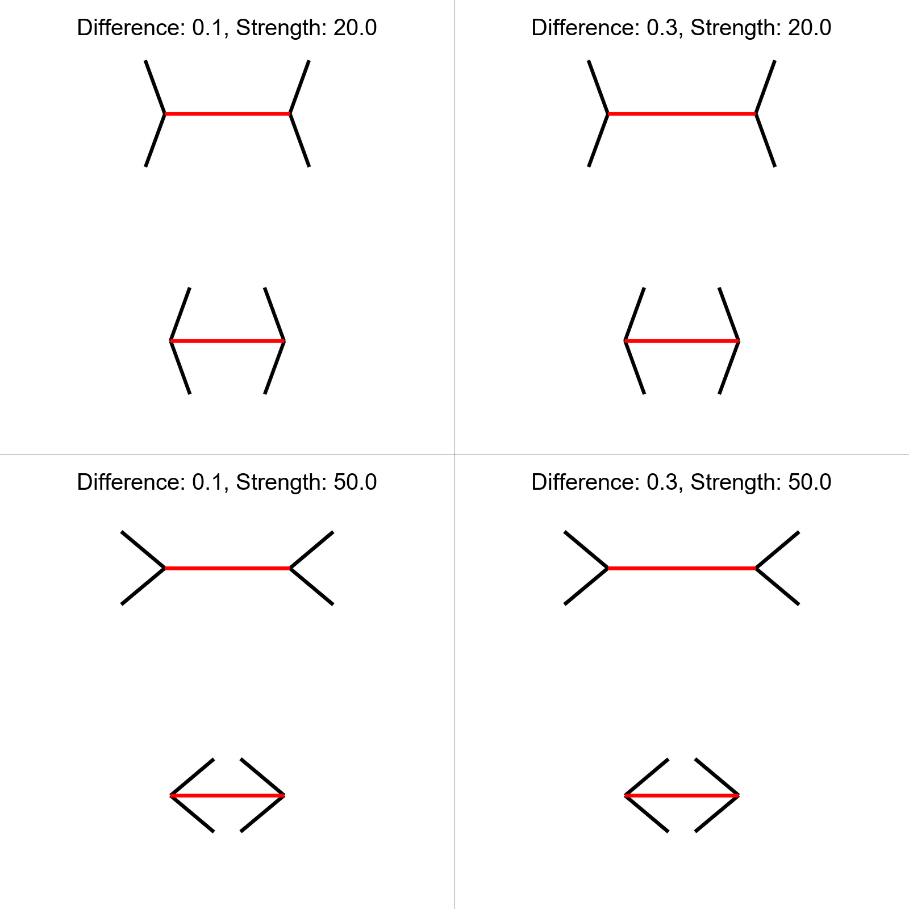
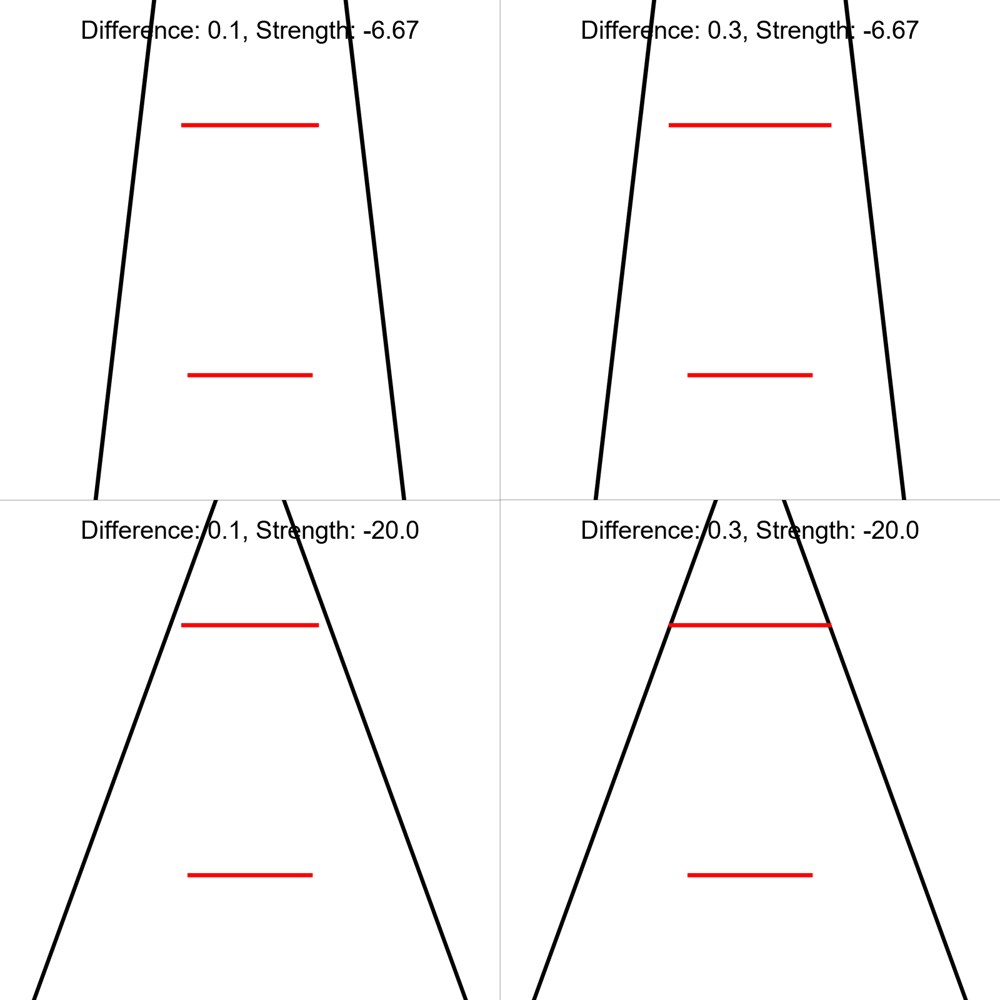
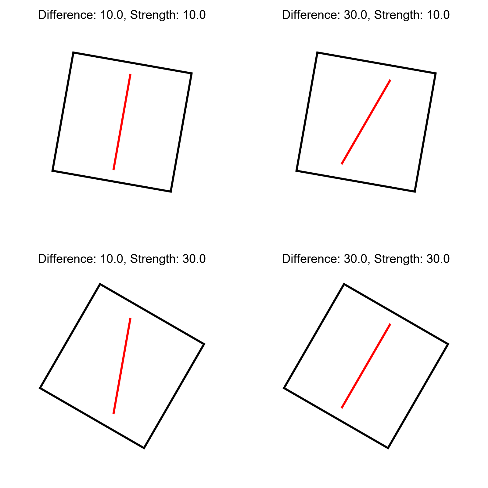
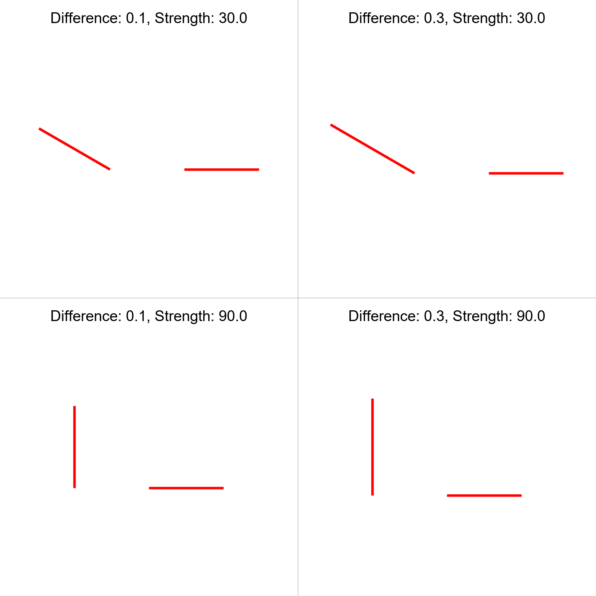
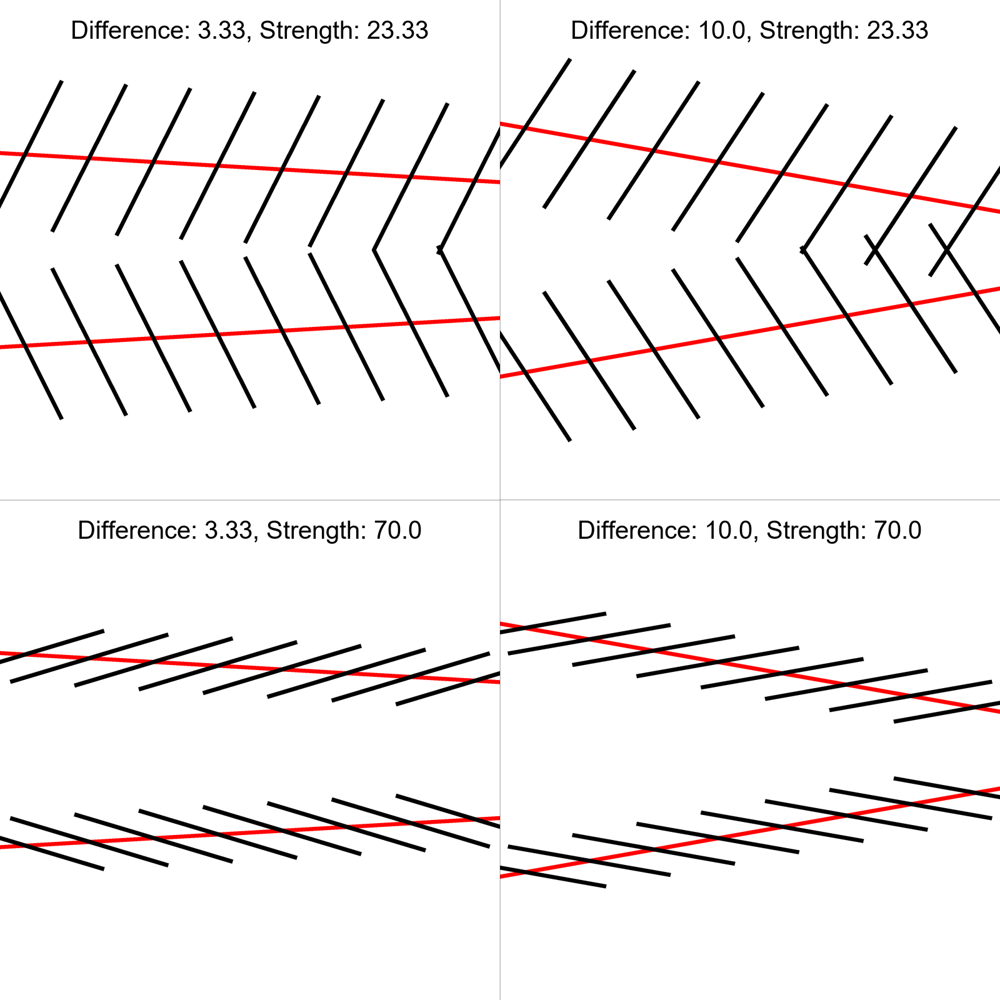
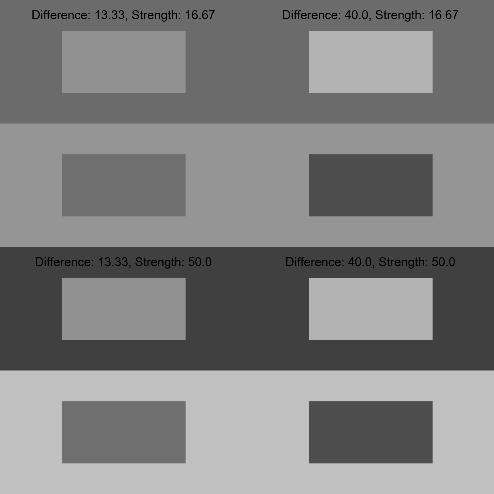

# IllusionGame
A game based on visual illusions.

## To Do

### Experimental Structure
- [x] Basic skeleton of `experiment.js`
- [x] Decide on size of illusions
  - <s>width: 1024, height: 576</s>
  - images to be squares
- [ ] Include all illusions 
  - [x] Delboeuf
  - [x] Ebbinghaus
  - [x] MullerLyer
  - [x] Ponzo
  - [ ] Vertical Horizontal
  - [ ] Contrast
  - [ ] White
  - [ ] Poggendorff
  - [ ] RodFrame
  - [ ] Zollner
- [x] Pop up to go full screen (start of experiment)
- [x] Finalize instructions to clarify on key / screen press
- [x] Would be more efficient to preload the stimuli before each block (rather than everything at the start)
- [x] Compute score and RT for each block of illusions
- [x] Show feedback after each block of illusions
  - Feedback to consist of **inverse efficiency score** to show participants that they performed better than x% of the players
- [x] Final feedback to show overall score
- [x] Preprocessing script

### Automation
- [ ] Set up organization oauth
- [ ] Have data saved after each block and committed to GH even after experiment is quitted halfway
- [x] **Load stimuli from js file (Python script)
- [x] **Load average distribution scores from js file (R script)
- [ ] Workflow to run ** automatically with each commit

## Stimuli

