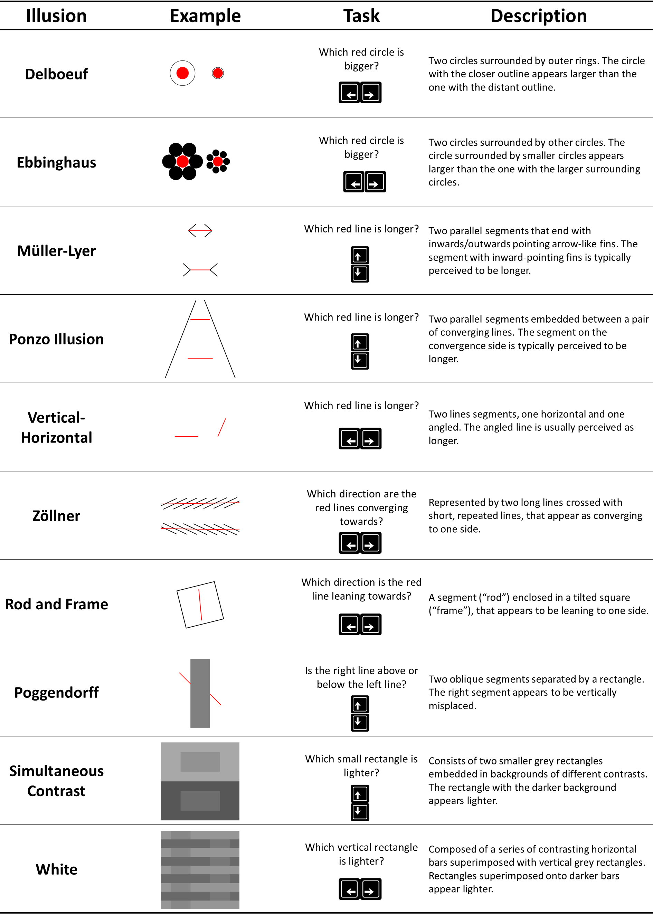

# The Illusion Game Validation Study

From here you can access various components of the study.

## Try Experiments

<!-- - [**Study 0**](https://realitybending.github.io/IllusionGameValidation/study0/index.html): Study 0 refers to an un-analyzed pilot of the perceptual task without the illusion (only the targets). -->
- [**Pilot**](https://realitybending.github.io/IllusionGameValidation/study1/index.html): The pilot study of the illusions that let to the refinement of the parameters of the illusions and the fixing of bugs in the illusion-generating software.
- [**Experiment**](https://realitybending.github.io/IllusionGameValidation/study2/index.html): Try the final experiment.

## See Results

- [**Pilot**](https://realitybending.github.io/IllusionGameValidation/study1/study1.html): In which we have a first look at the effects and refine the stimuli selection.
- [**Study (part 1)**](https://realitybending.github.io/IllusionGameValidation/study2/study2.html): In which we analyze the effect of illusion strength and task difficulty on errors and RT.
- [**Study (part 2)**](https://realitybending.github.io/IllusionGameValidation/study3/study3.html): In which we analyze the  links with personality.

## Download Data

- [**Study 2** (part 1)](data/study2_part1.csv): Can be assembled with `rbind(read.csv("study2_part1.csv"), read.csv("study2_part2.csv"))`
- [**Study 2** (part 2)](data/study2_part2.csv)
- [**Study 3**](data/study3.csv)

## Other

- IRB-2022-187 from NTU
- [**Preregistration**](https://osf.io/5d6xp)
- [**Pyllusion Software**](https://github.com/RealityBending/Pyllusion)

