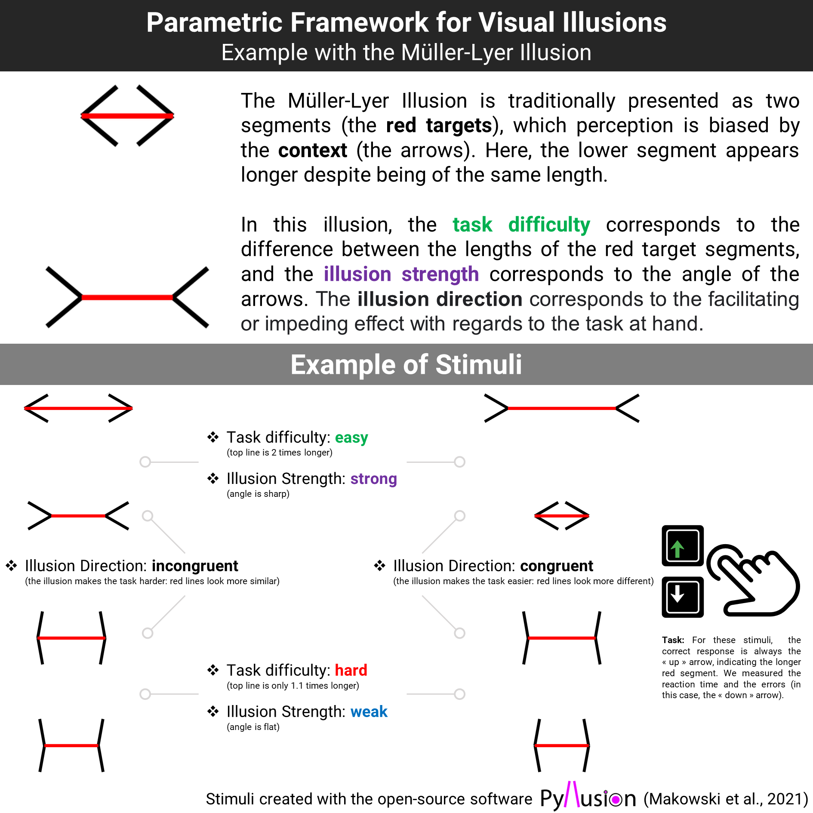

```{r, echo = FALSE, warning=FALSE, message=FALSE}
# options and parameters
options(digits = 3)

knitr::opts_chunk$set(
  collapse = TRUE,
  dpi = 450,
  fig.width = see::golden_ratio(9),
  fig.height = 9,
  fig.path = "figures/"
)

cache <- TRUE
```

<!-- Title: -->

<!-- The Illusion Game: Validation of a Novel Experimental Paradigm to study Visual Illusions  -->

# Introduction

<!-- Intro  & Gaps-->

Visual illusions are fascinating stimuli capturing a key feature of our neurocognitive systems. They eloquently show that our brains do not simply map veridical accounts of physical reality; we generate perceptions of the environment by taking into consideration the contextual information and the prior knowledge that manifests in our subjective conscious experience [@carbon2014]. Despite the withstanding interest in illusions within various fields of study, including that of visual perception [@day1972; @eagleman2001; @gomez-villa2022 ], consciousness science [@caporuscio2022, @lamme2020] and psychiatry [@notredame2014; @gori2016; @razeghi2022; @teufel2015re], several gaps still remain in the present research. Most notably, there is currently no universally agreed upon neurocognitive mechanism that explains individuals' susceptibility to visual illusions [@mylniec2016]. For instance, while some researchers have tried to explain our sensitivity to illusory effects as a result of deficits in the low-level visual processing system [@cretenoud2019; @gori2016], others have provided a compelling case using a top-down approach, suggesting that such visual phenomena occur as a result of a conflict between our visual input and our prior beliefs[@teufel2018; @caporuscio2022]. Furthermore, results from studies that have been conducted to elucidate the mechanism underlying our susceptibility towards visual illusions remain relatively mixed. Whereas higher resistance towards such illusions have been reported for individuals with pathologically strong prior beliefs (such as schizophrenics) and atypical sensory perception (for example, those with autism spectrum disorder (ASD)) [@notredame2014; @park2022; @giaouri2011; @keane2014], other studies have found no significant differences between such individuals and healthy controls [@spencer2014; @yang2012; @tibber2013; @kaliuzhna2019] or only a weak correlation between the magnitude of visual illusions and such individuals' susceptibility to these illusory effects [@grzeczkowski2018; @manning2017].

<!-- Pyllusion -->

One key challenge hindering the further development of illusion research is the relative difficulty in adapting visual illusions to an experimental setting, which typically requires the controlled modulation of the specific variables of interest. To address this issue, we first developed a parametric framework to manipulate visual illusions, of which we implemented and made accessible in the open-source software *Pyllusion* [@makowski2021]. This software allows us to generate different types of classic visual illusions and more importantly, dissociate the parameters of an illusion from its rendered output. Specifically, it enables us to modulate continuously and independently two parameters, *illusion strength* and *task difficulty*, that could then be manipulated systematically to conduct objective assessments on visual illusions (see **Figure 1**).

```{r message=FALSE, warning=FALSE, fig.cap="Explanation of the parametric framework for visual illusions (Makowski et al., 2021) applied to the Müller-Lyer illusion (above). Examples of stimuli showcasing the manipulation of the two main parameters, the task difficulty and the illusion strength (below)."}

```

<!-- Target, strength, difficulty -->
Indeed, many visual illusions can be seen as made of *targets* (e.g., same-length lines), which perception is biased by the *context* (e.g., in the Müller-Lyer illusion, the segments appear of different lengths when they end with inwards or outwards pointing arrows). While most of the paradigms used in the literature prompt the subjective extent the context biases the perception (e.g."how much doe the line appear different"; **REFS**), *Pyllusions* allows to create illusions in which the targets are actually more or less different (e.g., one segment is truly longer than the other), and in which the illusion varies in strength (the arrows are more or less pointy).

Indeed, many visual illusions can be seen as being composed of *targets* (e.g., same-length lines), of which perception is biased by the *context* (e.g., in the Müller-Lyer illusion, the same-length line segments appear to have different lengths when they end with inwards or outwards pointing arrows). In past studies, the implemented paradigms have mostly involved prompting the subjective extent the context biases the perception (for instance, by getting participants to adjust the parameters of one comparison stimulus (the size of a circle) to another (circle) e.g., @mylniec2016a; @grzeczkowski2018). Alternatively, *Pyllusion* allows us to create illusions while manipulating specific features of interest (e.g., size, length etc., ) and thereby the difficulty in distinguishing them, so that the targets are objectively distinct (i.e., one line segment is physically longer than the other), and the strength of the generated illusion are variable (i.e., the biasing angle of the arrows are more or less acute).

<!-- Paradigm -->
This opens the door of an experimental task in which participants have to make perceptual judgments about the targets (e.g., which segment in the longest) under different conditions of objective difficulty and illusion strength. Moreover, the illusion effect can be either "incongruent" (making the task even harder by biasing the perception in the opposite way) or "congruent" (making the task easier). Although visual illusions are inherently tied to subjective perception, this framework allows a reversal of the traditional paradigm that could quantify the "objective" effect of illusions by measuring its behavioral effect (error rate and reaction times) on the performance in a perceptual task.

<!-- Goals -->
In the present set of preregistered studies, we will first test this novel paradigm by investigate if the effect of illusion and task difficulty can be manipulated continuously and separated statistically. Then, we will use the paradigm to assess whether 10 different historical illusions (Delboeuf, Ebbinghaus, Rod and Frame, Vertical-Horizontal, Zöllner, White, Müller-Lyer, Ponzo, Poggendorff, Contrast) share a common latent factor (a long-standing debate). Finally, we will investigate how the the inter-individual sensitivity to illusions relates to other characteristics, such as demographic variables and personality.

In the present set of preregistered studies, we will first test this novel paradigm by investigating if the effect of illusion and task difficulty can be manipulated continuously, and separated statistically. Then, we will further utilize the paradigm to assess whether 10 different cannonical illusions (Delboeuf, Ebbinghaus, Rod and Frame, Vertical-Horizontal, Zöllner, White, Müller-Lyer, Ponzo, Poggendorff, Contrast) share a common latent factor (a long-standing debate, [@hamburger2016; @cretenoud2019a; @teufel2018a; @cretenoud2020]). Finally, we will investigate how the the inter-individual sensitivity to illusions relates to other characteristics, such as demographic variables and personality.

In line with our open-science standards, all the material (stimuli generation code, experiment code, raw data, analysis script with complementary figures and analyses, preregistration, etc.) is available and open-source at [**https://github.com/RealityBending/IllusionGameValidation**](https://github.com/RealityBending/IllusionGameValidation){.uri}.

# Study 1

## Aim

The objective of Study 1 is to act as a pilot study in order to gather some preliminary data to 1) assess whether the stimuli generated by *Pyllusion* behaves as expected for each of the 10 illusion types (i.e., increase of task difficulty and illusion strength leads to an increased error rate) and 2) develop a gauged understanding of the magnitude of effects, to then refine the stimuli parameters to a more sensible range (i.e., not overly easy and not impossibly hard).

## Procedure

We generated 56 stimuli for each of the 10 illusion types. These stimuli resulted from the combination of 8 linearly-spread levels levels of task difficulty (e.g., [1, 2, 3, 4, 5, 6, 7], where 1 corresponds to the higher difficulty - i.e., the smallest objective difference between targets) and 7 levels of illusion strength (3 values of strength on the congruent side, 3 on the incongruent side, and 0; e.g., [-3, -2, -1, 0, 1, 2, 3], where the negative values correspond to congruent illusion strengths).

The 10 illusion blocks were randomly presented, and the order of the 56 stimuli within the block was also randomized. After the first series of 10 blocks, another series was done (with new randomized blocks and trials order). In total, each participant saw 56 different trials per 10 illusion type, repeated 2 times (total = 1120 trials), to which they had to respond "as fast as possible without making errors" (i.e., an explicit double constraint to mitigate the inter-individual variability in the speed-accuracy trade off). The task was implemented using *jsPsych* (*REF*). See instructions for each illusion type in the experiment code.


## Participants

Fifty-two participants were recruited via *Prolific* ([www.prolificacademic.co.uk](www.prolificacademic.co.uk)), a popular crowd-sourcing platform to recruit subjects for online behavioural research. In a study comparing across different research recruitment platforms (e.g., MTurks, Qualtrics etc.,,), participants from *Prolific* were found to provide the highest data quality across all examined measures, including that of attention (the extent to which participants actually read the questions prior to responding), comprehension (the extent to which participants were able to understand the task instructions or items), honesty (the degree to which participants responded to questions truthfully) and reliability (the extent to which participants' responses are internally consistent within the same scale) [@peer2022]. For the purposes of our study, no restrictions on age or country were imposed on participant recruitment; the only requisite was a "fluent" proficiency in English to ensure that the task instructions, given in English, would be well-comprehended. Participants were incentivized with a reward of about \textsterling 7.5 for completing the task, which took an average of an hour to finish.

Average error rate and reaction time distributions were analysed in the pre-processing of the data. We removed 6 participants upon inspection of their average error rage (which was close to 50%, suggesting random answers), and because their reaction time distributions were implausibly fast. For the remaining participants, we discarded blocks where the error rate was higher than 50% (possibly indicating that participants misunderstood the instructions given; e.g., participants were selecting the shorter line instead of the longer one). Finally, we removed 692 (1.37%) trials based on an implausibly short or lomg response time (\< 150 ms or \> 3000 ms).

The final sample included 46 participants (Mean age = 26.7, SD = 7.7, range: [19, 60]; Sex: 39.1% females, 56.5% males).

## Data Analysis

The analysis of study 1 focused on the probability of errors as the main outcome variable. For each illusion, we started by visualizing the average effect of task difficulty and illusion strength to gain some perspective on the underlying generative model. Next, we tested the performance of various logistic models differing in their specifications, such as: with or without a transformation of the task difficulty (log, square root or cubic root), with or without a 2nd order polynomial term for the illusion strength, and with or without the illusion side (up *vs.* down or left *vs.* right) as an additional predictor. We then fitted the best performing model under a Bayesian framework, and compared its visualization with that of a General Additive Model (GAM), which has an increased ability of mapping underlying potentially non-linear relationships (at the expense of model simplicity).

The analysis was carried out using *R 4.2* [@RCoreTeam2022], *brms* [@Burkner2017], the *tidyverse* [@wickham2019] and the *easystats* collection of packages [@easystatsPackage].

## Results

The statistical models suggested that the effect of task difficulty had a cubic relationship with error rate for the Delboeuf and Ebbinghaus illusions (both composed of circular shapes), square (\*\*quadratic/inverse?\*\*) relationship for the Rod and Frame and Vertical-Horizontal illusions, cubic relationship for the Zöllner and Poggendorff illusions, exponential relationship for the White illusion, cubic relationship for the Müller-Lyer and Ponzo illusions (both based on line lengths), and linear relationship for the Contrast illusion. Please see details and figures in the analysis script.

## Discussion

This study enabled a more precise elaboration, and therefore clearer understanding, of the exact magnitude of the parametric effects at stake and the type of interaction between them. Furthermore, it allowed us to better understand and test the stimuli generated by *Pyllusion*, as well as unintentionally uncover a few technological bugs and issues (for instance, the specification direction of the illusion strength was reversed in the software), which were fixed in a new release.

Crucially, this study allowed us to refine the range of task difficulty and illusion strength values in order to maximize information gain. In most illusions, the task difficulty exhibited a non-linear effect, which is in line with the psychophysics literature on perceptual decisions ([@ditzinger2010; @shekhar2021; @bogacz2006]). In particular, one notable result was the illusion effect for the Zöller illusion, which suggested a non-linear relationship. By generating a wider range of illusion strength values, the next study will attempt at clarifying this point.

# Study 2

## Aim

The aim of study 2 was two-fold. In the first part, we will carefully model the error rate and the reaction time of each illusion type in order to validate our novel paradigm and show that the effect of illusions can be manipulated parametrically. In the second part, we will derive the participant-level scores from the models (i.e., the effect of illusion strength, task difficulty and their interaction for each individual) and analyze their latent factors structure.

## Procedure

The paradigm of study 2 was similar to that of study 1, with a few changes: namely, the illusory stimuli were re-generated within a refined space of parameters based on the results of study 1. Moreover, taking into account the findings of study 1, we used non-linearly spaced difficulty levels, depending on the best underlying model (i.e., with an exponential, square or cubic spacing depending on the relationship). For instance, a linear space of [0.1, 0.3, 0.5, 0.7] can be transformed to an exponential space of [0.1, 0.27, 0.47, 0.7].

Additionally, instead of repeating each series of illusion blocks once so that each illusion stimuli is seen two times, we generated more stimuli by increasing the degree of variation in the manipulated parameters (i.e., with more levels of difficulty and illusion strength). As such, for each illusion type, we generated a total of 134 stimuli that were split into two groups (67 stimuli per illusion block). Furthermore, instead of a simple break screen, we added two personality questionnaires between the two series of 10 illusion blocks (see study 3).

## Participants

Using the same recruitment procedure as in study 1, we recruited 256 participants, within which 6 were identified as outliers and excluded, leaving a final sample of 250 participants (Mean age = 26.5, SD = 7.6, range: [18, 69]; Sex: 48% females, 52% males). Please see the next study (study 3) for the full demographic breakdown. We discarded blocks with more than 50% of errors (2.16% of trials) and 0.76% trials with extreme response times (\< 125 ms or \> 4 SD above mean).

## Data Analysis

The first part of the analysis focuses on modelling the effect of illusion strength and task difficulty on errors and reaction time, within each illusion. In order to achieve that, we will start by fitting a General Additive Models (GAMs), which can accommodate possible non-linear effects and interactions. Errors were analyzed using Bayesian binomial mixed models, and reaction times (RT) of correct responses were analyzed using an ex-Gaussian family with the same fixed effects entered for the location $\mu$ (mean), scale $\sigma$ (spread) and tail-dominance $\tau$ of the RT distribution [@balota2011moving; @matzke2009psychological].

Using the GAMs as a "ground-truth", we will attempt at approximating them using general linear models, which have the advantage of specifying a participant-level variability of the effects (via random effects). Firstly, we will do a model comparison between a combination of transformations (raw, log, square root or cubic root) on the main predictors (task difficulty *diff* and illusion *strength*). We will then select and fit the best models (best on their indices of fit), and compare their predictions visually (see **Figure 2**).

We will then extract the inter-individual variability (specified as random slopes) in the effects of illusion strength, task difficulty and their interaction and use it as participant-level scores. Finally, We will explore the relationship across different illusions using exploratory factor analysis (EFA) and structural equation modelling (SEM).

## Results

The best models were $log(diff)*strength$ for Delboeuf; $sqrt(diff)*strength$ for Ebbinghaus; $log(diff)*log(strength)$ for Rod and Frame; $sqrt(diff)*sqrt(strength)$ for Vertical-Horizontal; .... In all of these models, the effect of illusion strength, task difficulty and their interaction were significant.

For errors, most of the models closely matched their GAMs counterpart, with the exception of Delboeuf for which the GAM suggested a non-monotonic effect of illusion strength with a local minimum at 0.


However, for reaction times, the GAMs suggested a consistent non-linear relationship between the mean RT and illusion strength: as the illusion strength gets very strong, the reaction times are faster. While this is is not surprising (strong illusions are so biasing that it is "easier", i.e., faster, to make the wrong decision), the linear models were not designed to capture this pattern and hence are not good representatives of the underlying dynamics. Because the random-slopes models for RT did not appear to capture well the underlying, likely quadratic, relationship, we decided not to use add them for the individual scores analysis.
<!-- Additionally, it would have increased the parameter space from 20 to 40 variables, which was deemed as statistically unreasonable given our sample size). -->

Though imperfect, we believe that these models capture inter-individual differences more accurately than basic empirical scores (e.g., the total amount of errors, or the average RT). Thus, for each illusion, we have extracted the effect of illusion strength and its interaction with task difficulty (when the illusion incongruent) within each participants. These twenty participant-level scores were subjected to exploratory factor analysis (EFA), which suggested that ...


With regards to its effect on errors, most of the models closely matched their GAMs counterpart, with the exception of Delboeuf for which the GAM suggested a non-monotonic effect of illusion strength with a local minimum at 0.

However, regarding the effect on reaction times, the GAMs suggested a consistent non-linear relationship between the mean RT and illusion strength: as the illusion strength increases, the reaction times are faster. While this is is not entirely surprising (for instance, it is conceptually possible to theorize that strong illusions are so effective at biasing our visual perceptions that it is "easier", i.e., faster, to make the wrong decision), the linear models were not designed to capture this pattern and hence are not good representatives of the underlying dynamics. Because the random-slopes models for RT did not appear to capture well the underlying, likely quadratic, relationship, we decided not to include them for the individual scores analysis. <!-- Additionally, it would have increased the parameter space from 20 to 40 variables, which was deemed as statistically unreasonable given our sample size). -->

Though imperfect, we believe that these models capture inter-individual differences more accurately than basic empirical scores (e.g., the total number of errors, or the average RT). Thus, for each illusion, we extracted the effect of illusion strength and its interaction with task difficulty (when the illusion effect was incongruent) within each participant. These twenty participant-level scores were subjected to exploratory factor analysis (EFA), which suggested that ...

## Discussion

<!-- This is likely to be caused by the outline. It will be fixed in the next release of the Pyllusion software. -->
Future studies should investigate reaction times to find the most appropriate models, and / or use models that integrate errors and reaction time (e.g., drift diffusion models).

# Study 3

## Aim

## Procedure

This study was based on the data collected in study 2. However, the variables of interest here were taken from the questionnaires that were inserted in between the two series of illusion blocks. We used the *IPIP6* (24 items; [@sibley2011]) to measure 6 personality traits (namely, extraversion, openness, conscientiousness, agreeableness, neuroticism and honesty-humility). On the other hand, the PID-5 (25 items; [@hopwood2012]) was used to measure the degree to which participants inhibit psychopathological personality traits (Disinhibition, antagonism, detachment, negative affect and psychoticism). The participants were the same as in study 2. However, due to a technical issue, no data on the personality questions are available for the first eight participants.

# General Discussion

Using the parametric illusion generation framework we developed, *Pyllusion* [@makowski2021a], we have hence shown that illusions can be manipulated continuously across several different visual illusions. This thus opens the door for new illusions-based paradigms and tasks, therefore making it possible for future researchers to directly manipulate specific features and parameters of the illusion that are of interest. The validation of this novel framework also affords future illusion scientists a standardized measure of illusion susceptibility, instead of relying on conventional methods that depend upon participants' subjective perceptions. In our paradigm, in which we apply this approach to a reaction-time task, we were able to measure inter-individual scores of objective illusion sensitivity.

# Future Directions

We strongly invite researchers to explore and re-analyze our dataset with other approaches and methods to push the understanding of visual illusions and illusion sensitivity further. The task, data and analysis script are available in open-access at **https://github.com/RealityBending/IllusionGameValidation**.

\newpage

# References

::: {#refs custom-style="Bibliography"}
:::
