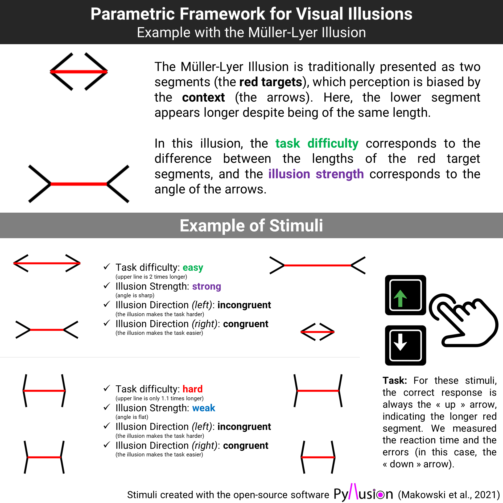

```{r, echo = FALSE, warning=FALSE, message=FALSE}
# options and parameters
options(digits = 3)

knitr::opts_chunk$set(
  collapse = TRUE,
  dpi = 450,
  fig.width = see::golden_ratio(9),
  fig.height = 9,
  fig.path = "figures/"
)

cache <- TRUE
```

<!-- Significance Statement (< 120 words) -->
<!-- A novel paradigm to study the objective effect of visual illusions is presented, which yielded evidence in favor of a common factor to visual illusions (Factor *i*) and a relationship between a low illusion sensitivity and maladaptive personality traits, such as antagonism, psychoticism and disinhibition. -->

# Introduction

<!-- Intro  & Gaps-->

Visual illusions are fascinating stimuli capturing a key feature of our neurocognitive systems. They eloquently show that our brains did not evolve to be perfect perceptual devices providing veridical accounts of physical reality, but integrate prior knowledge and contextual information - blended together in our subjective conscious experience [@carbon2014]. Despite the longstanding interest within the fields of visual perception [@day1972; @eagleman2001; @gomez-villa2022], consciousness science [@caporuscio2022; @lamme2020], and psychiatry [@notredame2014; @gori2016; @razeghi2022; @teufel2015], several important issues remain open.

Notably, the presence of a common mechanism underlying the effects of different illusions has been contested [@hamburger2016; @cretenoud2019; @cretenoud2020illusions]; and the nature of the underlying processes - whether related to low-level features of the visual processing system [@cretenoud2019; @gori2016] or to top-down influences of prior beliefs [@teufel2018; @caporuscio2022] are strongly debated. The existence of dispositional correlates of illusion sensitivity is another area of controversy, with some studies reporting higher illusion resistance in patients with schizophrenia and autism [@notredame2014; @park2022; @giaouri2011; @keane2014; @pessoa2008], and in individuals with stronger aggression and narcissism traits [@zhang2017; @konrath2009seeing].

<!-- Pyllusion -->

One key challenge hindering the further development of illusion research is the relative difficulty of adapting visual illusions to an experimental setting, which typically requires the controlled modulation of the specific variables of interest. To address this issue, we first developed a parametric framework to manipulate visual illusions that we implemented and made accessible in the open-source software *Pyllusion* [@makowski2021]. This software allows us to generate different types of classic visual illusions with a continuous and independent modulation of two parameters: *illusion strength* and *task difficulty* (**Figure 1**).

```{r message=FALSE, warning=FALSE, fig.cap="The parametric framework for visual illusions (Makowski et al., 2021) applied to the Müller-Lyer illusion (above). Below are examples of stimuli showcasing the manipulation of two parameters, task difficulty and illusion strength.", out.width="100%"}

```

<!-- Target, strength, difficulty -->

Indeed, many visual illusions can be seen as being composed of *targets* (e.g., same-length lines), of which perception is biased by the *context* (e.g., in the Müller-Lyer illusion, the same-length line segments appear to have different lengths if they end with inwards vs. outwards pointing arrows). Past illusion studies traditionally employed paradigms focusing on participants' subjective experience, by asking them the extent to which they perceive two identical targets as different [@lanyi2022can], or having them adjust the targets to match a reference stimulus relying only on their perception [@mylniec2016; @grzeczkowski2018]. Alternatively, *Pyllusion* allows the creation of illusions in which the targets are objectively different (e.g., one segment is truly more or less longer than the other), and in which the illusion varies in strength (the biasing angle of the arrows is more or less acute).

<!-- Paradigm -->

This opens the door for an experimental task in which participants make perceptual judgments about the targets (e.g., which segment is the longest) under different conditions of objective difficulty and illusion strength. Moreover, the illusion effect can be either "incongruent" (making the task more difficult by biasing the perception in the opposite way) or "congruent" (making the task easier). Although visual illusions are inherently tied to subjective perception, this framework allows a reversal of the traditional paradigm to potentially quantify the "objective" effect of illusions by measuring its behavioral effect (error rate and reaction times) on the performance in a perceptual task.

<!-- Goals -->

The aim of the present preregistered study is three-fold. First, we will test this novel paradigm by investigating if the effect of illusion strength and task difficulty can be manipulated continuously for 10 different classic illusions (Delboeuf, Ebbinghaus, Rod and Frame, Vertical-Horizontal, Zöllner, White, Müller-Lyer, Ponzo, Poggendorff, Contrast). Next, we will investigate the factor structure of illusion-specific performance scores and test the existence of a common latent factor of illusion sensitivity. Finally, we will explore how illusion sensitivity relates to demographic characteristics, contextual variables, and personality traits.

Following open-science standards, all the material (stimuli generation code, experiment code, raw data, analysis script with complementary figures and analyses, preregistration, etc.) is available as **Supplementary Materials** at [**https://github.com/RealityBending/IllusionGameValidation**](https://github.com/RealityBending/IllusionGameValidation){.uri}.


# Methods

## Stimuli

A pilot study (*n = 46*), of which full description is available in the Supplementary Materials, was first conducted to determine a sensitive range of stimuli parameters. Then, for each of the 10 illusion types, we generated a total of 134 stimuli. These stimuli resulted from the combination of 15 equally-spaced levels of illusion *strength* (7 negative, i.e., congruent effects; 7 positive, i.e., incongruent effects; and 0) overlapped with 16 non-linearly spaced task *difficulty* levels (i.e., with an exponential, square or cubic spacing depending on the pilot results). For instance, a linear space of [0.1, 0.4, 0.7, 1.0] can be transformed to an exponential space of [0.1, 0.34, 0.64, 1.0], where 0.1 corresponds to the highest difficulty - i.e., the smallest objective difference between targets). For each illusion type, the stimuli were split into two series (56 and 72 stimuli per series) with alternating parameter values to maintain their homogeneity. Additionally, 6 stimuli per illusion type was generated for a practice series, with more extreme variations (i.e., containing very easy trials to help cement the task instructions). 


## Procedure

After a brief demographic survey and a practice series of illusions, the first series of 10 illusion blocks was presented in a randomized order, with a further randomization of the stimuli order within each block. Following this first series of blocks, two personality questionnaires were administered, the *IPIP6* [24 items, @sibley2011] - measuring 6 "normal" personality traits (Extraversion, Openness, Conscientiousness, Agreeableness, Neuroticism and Honesty-Humility), and the *PID-5* [25 items, @hopwood2012] - measuring 5 "pathological" personality traits (Disinhibition, Antagonism, Detachment, Negative Affect and Psychoticism). Next, the second series of 10 illusion blocks was presented (with new randomized orders of blocks and trials). In total, each participant underwent 1340 trials of which they had to respond "as fast as possible without making errors" (i.e., an explicit double constraint to mitigate the inter-individual variability in the speed-accuracy trade off) by pressing the correct arrow key  (left/right,or up/down depending on the illusion type). For instance, in the Müller-Lyer block, participants had to answer which one of the upper or bottom target line was the longest. The task was implemented using *jsPsych* [@de2015jspsych], and the set of instructions for each illusion type is available in the experiment code.


## Participants


Participants were recruited via *Prolific*, a crowd-sourcing platform recognized for providing high quality data [@peer2022]. The only inclusion criterion was a fluent proficiency in English to ensure that the task instructions would be well-understood. Participants were incentivised with a reward of about \textsterling 7.5 for completing the task, which took about 50 minutes to finish. Demographic variables (age, gender, and ethnicity) were self-reported on a voluntary basis.

We excluded 6 participants upon inspection of the average error rate (when close to 50%, suggesting random answers), and reaction time distribution (when implausibly fast). For the remaining participants, we discarded blocks with more than 50% of errors (2.16% of trials), possibly indicating that instructions were misunderstood (e.g., participants focused on the shorter line instead of the longer one), and 0.76% trials with extreme response times (\< 125 ms or \> 4 SD above mean). Additionally, due to a technical issue, no personality data was recorded for the first eight participants.

The final sample included 250 participants (Mean age = 26.5, SD = 7.6, range: [18, 69]; Sex: 48% females, 52% males).


## Data Analysis

The first part of the analysis focused on modelling the effect of illusion strength and task difficulty on errors and reaction time (RT) within each illusion. We started by fitting General Additive Models (GAMs), which can parsimoniously accommodate possible non-linear effects and interactions. Errors were analyzed using Bayesian logistic mixed models, and RTs of correct responses were analyzed using an ex-Gaussian family with the same fixed effects entered for the location $\mu$ (mean), scale $\sigma$ (spread) and tail-dominance $\tau$ of the RT distribution [@balota2011moving; @matzke2009psychological].

Using GAMs as the "ground-truth" models, we attempted at approximating them using general linear mixed models, which can be used to estimate the effects' participant-level variability (via random slopes). Following a comparison of models with a combination of transformations (raw, log, square root or cubic root) on the main predictors (task *difficulty* and illusion *strength*), we fitted the best model (based on their indices of fit), and compared their output visually (**Figure 2**).

The inter-individual variability in the effect of illusion strength and its interaction with task difficulty was extracted from the models and used as participant-level scores. We then explored the relationship of these indices across different illusions using exploratory factor analysis (EFA) and structural equation modelling (SEM), and tested the existence of a general of illusion sensitivity (Factor *i*).

Finally, for each of the individual illusion sensitivity scores (10 illusion-specific factors and the general Factor *i*), we tested the effect of contextual variables (screen size, screen refresh rate), demographic variables (sex, education, age), and personality traits. 

The analysis was carried out using *R 4.2* [@RCoreTeam2022], *brms* [@Burkner2017], the *tidyverse* [@wickham2019], and the *easystats* collection of packages [@bayestestRArticle; @correlationArticle; @performanceArticle; @insightArticle]. As the full results are available as supplementary materials, we will focus here on the significant results [based on the Bayes Factor *BF* or the Probability of Direction *pd*, see @makowski2019indices].

```{r message=FALSE, warning=FALSE, out.width="100%", fig.cap="Top: the effect of illusion strength and task difficulty on the error rate and reaction time (RT) for each individual illusion. The solid line represents the General Additive Model (GAM), and the dashed line corresponds to its approximation via linear models. Descriptive data is shown with stacked dots (for which errors start from the top) and distributions for RTs. Negative values for illusion strength correspond to congruent (i.e., facilitating) illusion effects. Task difficulty (the objective difference between the targets of perceptual decision) levels are shown as colors, with lower values corresponding to harder trials. The results for each illusion are surrounded by 4 extreme examples of stimuli, corresponding to the hardest difficulty (on top) and the strongest illusion (on the right for incongruent illusions). Bottom: We extracted the effect slope of the illusion strength and its interaction with task difficulty for each participant. We fitted a Structural Equation Model (SEM) suggesting that these manifest variables group to first-level illusion-specific latent factors, which then load on a general factor of illusion sensitivity (Factor \\textit{i})."}
knitr::include_graphics("../figures/Figure2.png")
```

# Results

## Effects of Illusion Strength and Task Difficulty

The best model specifications were $log(diff)*strength$ for Delboeuf; $sqrt(diff)*strength$ for Ebbinghaus; $log(diff)*log(strength)$ for Rod and Frame; $sqrt(diff)*sqrt(strength)$ for Vertical-Horizontal; $cbrt(diff)*strength$ for Zöllner; $diff*sqrt(strength)$ and $log(diff)*strength$ respectively for errors and RT in White; $sqrt(diff)*sqrt(strength)$ and $sqrt(diff)*strength$ respectively for errors and RT in Müller-Lyer; $cbrt(diff)*strength$ for Ponzo; $cbrt(diff)*sqrt(strength)$ and $cbrt(diff)*strength$ respectively for errors and RT in Poggendorff; and $sqrt(diff)*sqrt(strength)$ for Contrast. For all of these models, the effects of illusion strength, task difficulty and their interaction were significant.

For error rates, most of the models closely matched their GAMs counterpart, with the exception of Delboeuf (for which the GAM suggested a non-monotonic effect of illusion strength with a local minimum at 0) and Zöllner (for which theoretically congruent illusion effects were related to increased error rate). A specific discussion regarding these 2 illusions is available in the Supplementary Materials (Part 1 - Discussion).

For RTs, the GAMs suggested a consistent non-linear relationship between RT and illusion strength: as the illusion strength increases beyond a certain threshold, the participants responded faster. While this is is not surprising (strong illusions are likely so effective in biasing perception that it is "easier", i.e., faster, to make the wrong decision), the linear models were not designed to capture this - likely quadratic - pattern and hence are not good representatives of the underlying dynamics. As such, we decided not to use them for the individual scores analysis. <!-- Additionally, it would have increased the parameter space from 20 to 40 variables, which was deemed as statistically unreasonable given our sample size). -->

## Factor Structure


Though imperfect, we believe that the random-slope models capture inter-individual differences with more accuracy (and also provide more conservative estimates due to shrinkage) than basic empirical scores, such as the total number of errors, or the average RT. Thus, for each illusion and within each participant, we extracted the effect of illusion strength and its interaction with task difficulty when the illusion effect was incongruent. These twenty participant-level scores were subjected to exploratory factor analysis (EFA). The Method Agreement Procedure [@parametersArticle] suggested the presence of 7 latent factors. An oblique (*oblimin* rotation) factor solution explaining 66.69% of variance suggested separate dimensions for the effect of Zöllner, White, Poggendorff, Contrast, Ebbinghaus, Delboeuf, and a common factor for the parameters related to Müller-Lyer, Vertical-Horizontal, Ponzo and Rod and Frame. We submitted these factors to a second-level analysis and extracted two orthogonal (*varimax* rotation) factors. The first factor was loaded by all the previous dimensions with the exception of Delboeuf, which formed its own separate factor.

Finally, we tested this data-driven model (*m0*) against four other structural models using structural equation modelling (SEM): one in which the two parameters of each of the 10 illusions (illusion strength and interaction with task difficulty) loaded on separate factors, which then all loaded on a common factor (*m1*); one in which the parameters were grouped by illusion type (lines, circles, contrast and angle) before loading on a common factor (*m2*); one in which all the parameters related to strength, and all the parameters related to the interaction loaded onto two respective factors, which then loaded on a common factor (*m3*); and one in which there was no intermediate level: all 20 parameters loaded directly on a common factor (*m4*).

The model *m1*, in which the parameters loaded on a first level of 10 illusion-specific factors, which then all loaded on a common factor, significantly outperformed the other models. Its indices of fit ranged from acceptable to satisfactory (CFI = .92; SRMR = .08; NNFI = .91; PNFI = .74; RMSEA = .08), and all the specified effects were significant. The illusion-specific latent factors were loaded positively by the sensitivity to illusion strength, as well as by the interaction effect with task difficulty (with the exception of Delboeuf, Ebbinghaus, Vertical-Horizontal, Müller-Lyer and Contrast, for which the loading was negative). The general factor of illusion sensitivity, labelled Factor *i* (i- for illusion), explained 48.02% of the total variance of the initial dataset, and was strongly related to Vertical-Horizontal ($\beta_{std.}=0.83$), Müller-Lyer ($\beta_{std.}=0.76$), Ponzo ($\beta_{std.}=0.65$), Ebbinghaus ($\beta_{std.}=0.64$); moderately to Zöllner ($\beta_{std.}=0.53$), Poggendorff ($\beta_{std.}=0.44$), Rod and Frame ($\beta_{std.}=0.42$), Contrast ($\beta_{std.}=0.40$) and White ($\beta_{std.}=0.35$); and weakly to Delboeuf ($\beta_{std.}=0.19$). We then computed, for each participant, the score for the 10 illusion-specific factors and for the general Factor *i*.

It is important to note that these individual scores are the result of several layers of simplification: 1) the individual coefficient is that of simpler models that sometimes do not perfectly capture the underlying dynamics (especially in the case of Delboeuf and Zöllner); 2) we only used the models on error rate, which could be biased by the speed-accuracy decision criterion used by participants; 3) the structural equation model used to compute the scores also incorporated multiple levels of abstractions. Thus, in order to validate the individual scores, we computed the correlation between them and simple empirical scores, such as the average error rate and the mean RT in the task. This analysis revealed strong and significant correlations between each illusion-specific factor and the average amount of errors in its corresponding task. Moreover, each individual score was strongly associated with the average RT across multiple illusion types. This suggests that the individual scores obtained from the structural equation model do capture the sensitivity of each participant to visual illusions, manifesting in both the number of errors and long reaction times.

## Correlations with Inter-individual Characteristics


The Bayesian correlation analysis (with narrow priors centered around a null effect) between the illusion scores and contextual variables (screen size and refresh rate) provided weak evidence in favor of an absence of effect, with the exception of the two contrast-based illusions (**Figure 3**). Anecdotal ($BF_{10} = 2.05$) and moderate evidence ($BF_{10} = 4.11$) was found for a negative correlation between screen size and the sensitivity to the White and the Contrast illusion, respectively. To test whether this result could be an artifact related to the highly skewed screen size distribution (caused by very few participants with extreme screen sizes), we re-ran a robust correlation (with rank-transformed values), which provided even stronger evidence in favor of the effect existence ($BF_{10} = 28.19$, $BF_{10} = 4.31$ for White and Contrast, respectively).

```{r message=FALSE, warning=FALSE, fig.cap="The upper plots show the distribution of demographic and dispositional variables. The middle plots shows the illusion sensitivity scores as a function of sex and age (solid lines indicate significant relationships). Bottom plots show the correlation between the general factor of illusion sensitivity (Factor \\textit{i}) and personality traits.", out.width="100%"}
knitr::include_graphics("../figures/Figure3.png")
```


The Bayesian t-tests on the effect of sex suggested anecdotal to moderate evidence in favour of the null effect for all scores, with the exception of the sensitivity to the Zöllner illusion, which was higher in males as compared to females ($\Delta=-0.37$, 95% CI [-0.62, -0.13], $BF_{10} = 12.74$). We fitted Bayesian linear models with the education level entered as a monotonic predictor [appropriate for ordinal variables, @burkner2020modelling], which yielded no significant effects. For age, we fitted two types of models for each score, one general additive models (GAM) and a 2nd order polynomial model. These consistently suggested a significant positive linear relationship between age and Factor *i* ($pd=100\%$), as well as the sensitivity to Müller-Lyer ($pd=100\%$), Vertical-Horizontal ($pd=100\%$), Zöllner ($pd=100\%$) and Ebbinghaus ($pd=99\%$) illusions.

Regarding "normal" personality traits, Bayesian correlations suggested substantial evidence in favor of a positive relationship between *Honesty-Humility* and Zöllner ($BF_{10} > 100$), Vertical-Horizontal ($BF_{10} = 9.78$) and the Factor *i* ($BF_{10} = 4.00$); as well as between *Agreeableness* and Vertical-Horizontal ($BF_{10} = 25.06$), Ponzo ($BF_{10} = 4.88$) and the Factor *i* ($BF_{10} = 19.65$).

Regarding "pathological" personality traits, the results yielded strong evidence in favor of a negative relationship between illusion scores and multiple traits. *Antagonism* was associated with the sensitivity to Vertical-Horizontal ($BF_{10} > 100$), Müller-Lyer ($BF_{10} = 21.57$), Ponzo ($BF_{10} = 17.97$) illusions, and the Factor *i* ($BF_{10} = 55.45$); *Psychoticism* was associated with the sensitivity to Vertical-Horizontal ($BF_{10} = 66.63$) and Müller-Lyer ($BF_{10} = 35.59$) illusions, and the Factor *i* ($BF_{10} = 35.02$); *Disinhibition* was associated with the sensitivity to Vertical-Horizontal ($BF_{10} = 25.38$), Zöllner ($BF_{10} = 7.59$), Müller-Lyer ($BF_{10} = 5.89$) illusions, and the Factor *i* ($BF_{10} = 31.42$); and *Negative Affect* was associated with Zöllner ($BF_{10} = 62.04$), Vertical-Horizontal ($BF_{10} = 12.65$), Müller-Lyer ($BF_{10} = 3.17$), and the Factor *i* ($BF_{10} = 6.39$). The last remaining trait, *Detachment*, did not share any significant relationship with illusion sensitivity. See Supplementary Materials (Part 2 - Discussion) for a detailed discussion regarding these associations. 


# Discussion

<!-- Parametric framework -->

The parametric illusion generation framework developed in @makowski2021 proposes to conceptualize illusions as composed of targets and distractors that can be manipulated independently and continuously. In the present study, we have shown that such gradual modulation of illusion strength is effectively possible across 10 different types of classic visual illusions. Specifically, increasing the illusion strength led to an increase in the likelihood of errors, as well as the average and spread of RTs (but only up to a point, after which participants become faster at responding with the wrong answer). This important methodological step opens the door for new illusions-based paradigms and tasks to study the effect of illusions under different conditions and to quantify illusion sensitivity using objective behavioral outcomes - such as accuracy or speed - instead of subjective meta-cognitive reports. This new and complementary approach will hopefully help address some of the longstanding literature gaps, as well as cement illusions as valuable stimuli for the study of cognition. 

<!-- Factor i -->

Our findings suggest that the sensitivity to 10 different types of visual illusions share a common part of variance, supporting the existence of a general factor of illusion sensitivity (Factor *i*). This result comes in a field of mixed findings. In fact, contrary to early studies on visual illusions, more recent research have generally not found any significant evidence for a common stable factor across illusions within individuals [@grzeczkowski2017; @cretenoud2019; @cretenoud2020illusions; @grzeczkowski2018; @yang2012]. Instead, past findings suggest illusory effects are highly specific to the perceptual features of the illusions at stake [@grzeczkowski2017; @cretenoud2019]. It should be noted, however, that most of these studies were low-powered and/or relied on conventional paradigms, such as the adjustment procedure to measure the participants' subjective perception. We believe that our study presents several methodological improvements, including statistical power (high number of trials per participant), homogeneous stimuli (with minimal and highly controlled features) and tasks (decision-making reaction-time task), and a more reliable participant-level score extraction method (based on random-factors models), which in our opinion contributed to the emergence of the common factor.

However, although the illusions did differ in terms of the perceptual task (contrast-based, size-estimation, angle-perception), the possibility of our general factor being driven by inter-individual perceptual skills variability (or other cognitive skills) cannot be discarded. Future studies should investigate the relationship of illusion sensitivity with perceptual abilities (e.g., using similar tasks, but without illusions), and assess the psychometric properties - such as stability (e.g., test-retest reliability) and validity - of similar illusion-based paradigms.

<!-- Personality -->

Finally, we found the sensitivity to illusions to be positively associated with "positive" personality traits, such as agreeableness and honesty-humility, and negatively associated with maladaptive traits such as antagonism, psychoticism, disinhibition, and negative affect. Although the existing evidence investigating links between illusion sensitivity and personality traits is scarce, these results are consistent with past findings relating pathological egocentric beliefs [often associated with psychoticism, @fox2006] to reduced context integration, manifesting in a tendency to separate objects from their surroundings when processing visual stimuli  [@ohmann2016; @konrath2009seeing; @fox2006]. As such, the association between maladaptive traits and lower illusion sensitivity could be linked to a self-centered, decontextualized and disorganized information processing style. Conversely, the relationship between illusion sensitivity and adaptive personality traits is in line with the decreased field dependence (the tendency to rely on external cues in ambiguous contexts) associated with traits negatively correlated with agreeableness and honesty-humility, such as hostility, aggression and narcissism [@zhang2017; @konrath2009seeing; @pessoa2008].


Importantly, these findings highlight the relevance of illusions beyond the field of visual perception, pointing towards an association with high-level domain-general mechanisms. In particular, the evidence in favor of a relationship between maladaptive personality traits and illusion sensitivity is in line with clinical observations, in which a greater resistance to illusions have been reported among patients with schizophrenia [@notredame2014; @pessoa2008; @grzeczkowski2018], especially in association with schizotypal traits such as cognitive disorganization [@cretenoud2019; @lanyi2022can]. While the search for the exact mechanism(s) underlying these links is an important goal of future research, our findings unlock the potential of illusion-based tasks as sensitive tools to capture specific inter-individual neuro-cognitive differences.

In conclusion, we strongly invite researchers to explore and re-analyze our dataset with other approaches and methods to push the understanding of visual illusions and illusion sensitivity further. The task, data and analysis script are available in open-access at [**https://github.com/RealityBending/IllusionGameValidation**](https://github.com/RealityBending/IllusionGameValidation){.uri}.

# Acknowledgments

We would like to thank Zen J. Lau, Tam Pham, and W. Paul Boyce for their contribution to *Pyllusion*, as well as Prof Dólos for the inspiration.

\newpage

# References

::: {#refs custom-style="Bibliography"}
:::
